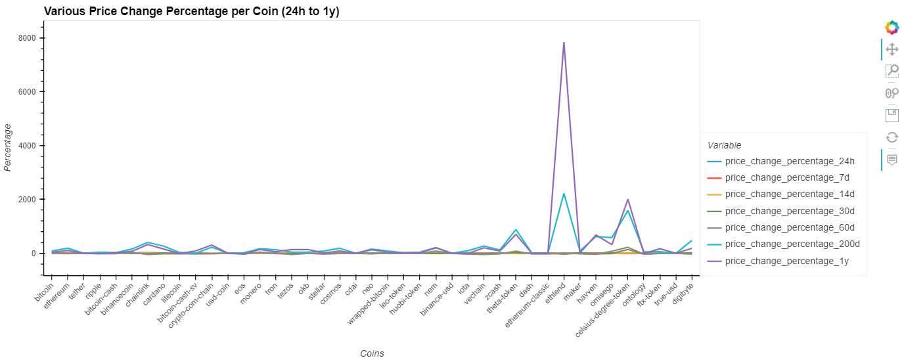

# Crypto Clusters Portfolio
*CRYPTO CLUSTERS PORTFOLIO* clusters cryptocurrencies by their performance in different time periods.


## Requirements

This application was writen in Jupyter Lab 3.3.2 using Python 3.9.7

**Operating System:**

-   Window 10 (or higher) using Gitbash.
-   MacOS 10.14 (or higher) using a terminal.
-   Linux Ubuntu 22.04 (or higher) using a terminal.

**Will need to be installed:**

_jupyter lab_  3.3.2

```
$ pip install jupyterlab
```

_pandas_  1.4.2
```
$ pip install pandas
```

hvPlot 0.8.0 

```
$ pip install hvplot
```

scikit-learn 1.1.1

```
$ pip install -U scikit-learn

```

----------

## Installation

To install the application you will need to clone the GitHub repository.

```
$ git clone https://github.com/yanickw/crypto_cluster_portfolio

```

----------

## Get Started

Using the  Passive Investing Notebook:

Open a gitbash, navigate to your github cloned repositery. Start **Jupyter Lab**

```
$ jupyter lab
```

### 1. Import and Prepare the Data.

To get started load the .csv file containing 41 different cryptocurrencies including several *price change percentages* for different time period.



Use the `StandardScaler` module from scikit-learn to normalize the CSV file data and nest it in a new Dataframe.

### 2. Find the Best Value for *k* Cluster Cryptocurrencies with K-means.

Using the elbow method, find the best value for `k` and plot a line chart with all the inertia values to visually identify the optimal value for  `k`.

Create, Fit and Use the model to create a scatter plot to identify the cryptocurrency represented by each data point.

### 3. Optimize Clusters using Principal Component Analysis (PCA).

Create a PCA with 3 components and determine how much information can be attributed to each principal component.

### 4. Find the Best Value for k and Cluster Cryptocurrencies with K-means Using the PCA Data.
Following the same process as in #2 but this time using the PCA Data.

### 5. ### Visualize and Compare the Results
Using composit plot to visually analyze the cluster analysis results by contrasting the outcome with and without using the optimization techniques. 

----------

## Contributors

This application originated from a Berkeley Bootcamp.

For any inquieries, feedbacks or comments about this project please email me at  [yanickw@gmail.com](mailto:yanickw@gmail.com)

I can also be reached on  [LinkedIn](https://www.linkedin.com/in/yanickwilisky/)  or  [Twitter](https://twitter.com/yanickwilisky).

----------

## License

MIT License

Copyright (c) 2022 Yanick Wilisky

Permission is hereby granted, free of charge, to any person obtaining a copy of this software and associated documentation files (the "Software"), to deal in the Software without restriction, including without limitation the rights to use, copy, modify, merge, publish, distribute, sublicense, and/or sell copies of the Software, and to permit persons to whom the Software is furnished to do so, subject to the following conditions:

The above copyright notice and this permission notice shall be included in all copies or substantial portions of the Software.

THE SOFTWARE IS PROVIDED "AS IS", WITHOUT WARRANTY OF ANY KIND, EXPRESS OR IMPLIED, INCLUDING BUT NOT LIMITED TO THE WARRANTIES OF MERCHANTABILITY, FITNESS FOR A PARTICULAR PURPOSE AND NONINFRINGEMENT. IN NO EVENT SHALL THE AUTHORS OR COPYRIGHT HOLDERS BE LIABLE FOR ANY CLAIM, DAMAGES OR OTHER LIABILITY, WHETHER IN AN ACTION OF CONTRACT, TORT OR OTHERWISE, ARISING FROM, OUT OF OR IN CONNECTION WITH THE SOFTWARE OR THE USE OR OTHER DEALINGS IN THE SOFTWARE.
